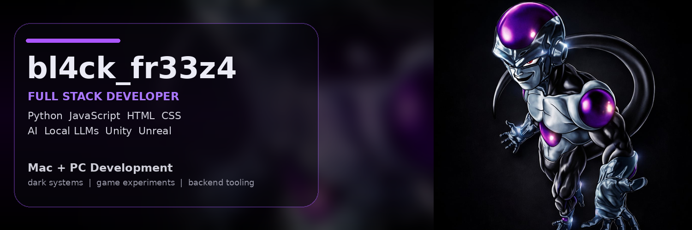

  

# bl4ck_fr33z4

Angehender Softwareentwickler kurz vor dem Abschluss der Ausbildung zum **Fachinformatiker für Anwendungsentwicklung**.

Mein Schwerpunkt liegt auf **Full-Stack-Development** mit einem Fokus auf Backend-Logik, Web-Technologien und modernen Entwicklungswerkzeugen.

Aktuell beschäftige ich mich außerdem mit:

- Local LLM Experimente
- AI Tools
- Game Development
- Backend Systeme und Automatisierung

---

## Core Stack

---

## Tools & Environment

---

## Experiments

Aktuelle Experimente:

- Game Systems
- Gameplay Prototypen
- Unity
- Unreal Engine

---

## Focus

Full Stack Development  
Artificial Intelligence Experiments  
Local LLM Systems  
Game Development
