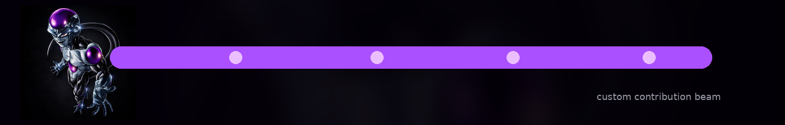

  

  

<h1 align="center">bl4ck_fr33z4</h1>

  Angehender Entwickler kurz vor dem Abschluss der Ausbildung zum Fachinformatiker für Anwendungsentwicklung.

  Hauptfokus: <strong>Full Stack Development</strong> mit <strong>Python, JavaScript, HTML und CSS</strong>

---

## Profile

Ich entwickle sowohl auf **Mac** als auch auf **Windows-PC** und arbeite aktuell daran, meine Fähigkeiten als **Full Stack Developer** systematisch auszubauen.

Neben klassischer Webentwicklung experimentiere ich mit:

- **Local LLMs**
- **AI Tools**
- **Backend Tooling**
- **Unity**
- **Unreal Engine**

---

## Core Stack

  
  
  
  

## Environment

  
  
  
  
  

## Current Technical Interests

  
  
  
  
  

## Game Development Experiments

  
  

## Custom Visual

  

## GitHub Statistics

  
  

## Development Activity

  

## Profile Summary

  

  
  

## Trophies

  

## Quote

  

## Visitors

  

## Focus

- Full Stack Development
- Python and JavaScript workflows
- AI tooling and local LLM experiments
- Backend-oriented systems
- Unity and Unreal experimentation
